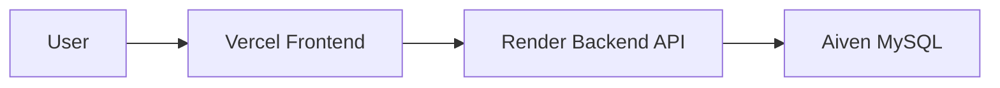
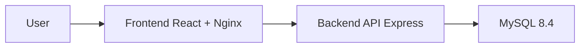

# Student Attendance System
//Test CI
Hệ thống quản lý điểm danh sinh viên theo ngày. Dự án gồm React frontend, Express backend API, MySQL database, Docker Compose cho môi trường local/CI, GitHub Actions CI, và production deploy bằng Vercel + Render + Aiven.

## Chức Năng

- Đăng nhập và phân quyền `admin`, `teacher`, `student`.
- Admin quản lý sinh viên, lớp học và thời khóa biểu.
- Giảng viên chọn lớp, import danh sách sinh viên và điểm danh.
- Sinh viên xem lịch học, lịch sử điểm danh và thống kê cá nhân.
- Điểm danh theo ngày với 4 trạng thái: `Có mặt`, `Vắng`, `Đi trễ`, `Có phép`.
- Mỗi sinh viên chỉ có một bản ghi điểm danh trong một ngày; lưu lại sẽ cập nhật.
- Khóa/mở khóa điểm danh theo lớp/ngày.
- Lọc và thống kê chuyên cần.
- Xuất báo cáo CSV.

## Tài Khoản Demo

| Username | Password | Role |
| --- | --- | --- |
| admin | Admin@123 | Quản trị hệ thống |
| teacher | Teacher@123 | Giảng viên |
| student | Student@123 | Sinh viên demo |

Mật khẩu production được cấu hình bằng biến môi trường trên Render.

## Cấu Trúc Thư Mục

```text
.
├── .github/workflows/ci.yml
├── backend/
│   ├── src/
│   ├── tests/
│   ├── Dockerfile
│   └── package.json
├── frontend/
│   ├── src/
│   ├── tests/
│   ├── Dockerfile
│   ├── vercel.json
│   └── package.json
├── docs/
│   └── import-samples/
├── scripts/
├── docker-compose.yml
├── render.yaml
├── .env.example
└── README.md
```

## Kiến Trúc

Production:



Local/CI:



## Chạy Local Bằng Docker

Tạo ENV từ file mẫu:

```powershell
Copy-Item .env.example .env
```

Chạy toàn bộ hệ thống:

```powershell
docker compose up -d --build
```

URL local:

- Frontend: `http://localhost:8080`
- Backend health: `http://localhost:4000/api/health`
- MySQL host port: `3307`
- Adminer: `http://localhost:8083`

Kiểm tra container và log:

```powershell
docker compose ps
docker compose logs backend --tail 100
docker compose logs mysql --tail 100
```

Smoke test:

```powershell
powershell -ExecutionPolicy Bypass -File .\scripts\smoke-test.ps1
```

## Deploy Production

- Frontend deploy trên Vercel từ thư mục `frontend`.
- Backend deploy trên Render bằng `render.yaml` hoặc Dockerfile `backend/Dockerfile`.
- Database dùng Aiven MySQL, bật SSL.
- Frontend cần biến `VITE_API_BASE_URL=https://<render-backend>.onrender.com/api`.
- Backend cần `CORS_ORIGIN=https://sasdau.vercel.app`.

Chi tiết xem [Deployment](docs/deployment.md).

## Seed Dữ Liệu Demo

Backend có script thêm dữ liệu demo cho production:

```bash
npm run seed:demo
```

Script này thêm lớp, giảng viên demo, sinh viên demo, lịch học và các buổi điểm danh trước đây. Script dùng upsert nên có thể chạy lại mà không tạo trùng dữ liệu.

Chỉ chạy script ở môi trường có ENV trỏ tới database cần seed, ví dụ Render/Aiven production hoặc local đã cấu hình DB production.

## API Chính

- `GET /api/health`
- `POST /api/auth/login`
- `POST /api/auth/register`
- `POST /api/auth/logout`
- `GET /api/auth/me`
- `GET /api/classes`
- `POST /api/classes`
- `PUT /api/classes/:id`
- `DELETE /api/classes/:id`
- `GET /api/users/unassigned-students`
- `GET /api/students`
- `POST /api/students`
- `PUT /api/students/:id`
- `DELETE /api/students/:id`
- `POST /api/students/import`
- `GET /api/attendance`
- `POST /api/attendance`
- `POST /api/attendance/lock`
- `POST /api/attendance/unlock`
- `GET /api/attendance/dates`
- `GET /api/stats`
- `GET /api/schedules`
- `POST /api/schedules`
- `PUT /api/schedules/:id`
- `DELETE /api/schedules/:id`
- `GET /api/schedules/teachers`
- `GET /api/schedules/timetable`
- `GET /api/reports/attendance.csv`

## CI/CD

GitHub Actions chạy khi `push` hoặc `pull_request` vào `main` và `dev`, hoặc chạy thủ công bằng `workflow_dispatch`.

- Backend: `npm ci`, lint, test, build.
- Frontend: `npm ci`, lint, test, build.
- Docker: `docker compose config`, `docker compose build`.
- CD production: Vercel deploy frontend, Render deploy backend.

## Tài Liệu

- [Architecture](docs/architecture.md)
- [Deployment](docs/deployment.md)
- [Debugging and incidents](docs/debugging-incidents.md)
- [Evidence checklist](docs/evidence-checklist.md)
- [Import samples](docs/import-samples/readme.md)

## Contributors

- [dpt004](https://github.com/dpt004) - Lead DevOps Engineer & Main Contributor
