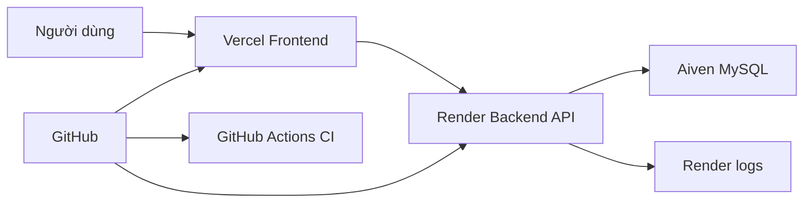
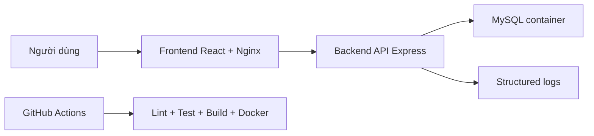
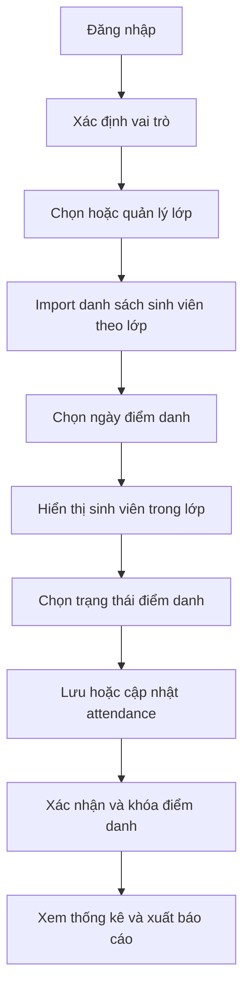

# Kiến Trúc Hệ Thống

## Mục Tiêu

Student Attendance System dùng để quản lý điểm danh sinh viên theo ngày, hỗ trợ giảng viên điểm danh theo lớp, admin quản lý dữ liệu nền và sinh viên xem lịch sử cá nhân.

Hệ thống đáp ứng yêu cầu DevOps bằng:

- Frontend: React + Vite.
- Backend API: Express.js.
- Database: MySQL 8.4.
- Local/CI packaging: Dockerfile riêng cho frontend/backend và `docker-compose.yml`.
- Production deployment: Vercel frontend, Render backend, Aiven MySQL.
- CI: GitHub Actions chạy install, lint, test, build và Docker build.

## Sơ Đồ Production

## Sơ Đồ Local/CI

## Module Chức Năng

| Module | Vai trò |
| --- | --- |
| Authentication | Đăng nhập, đăng xuất, đăng ký, phân quyền admin/teacher/student |
| Class Management | Admin thêm, sửa, xóa lớp và phân công giảng viên |
| Student Management | Admin quản lý sinh viên, import danh sách sinh viên theo lớp |
| Attendance | Admin/giảng viên điểm danh, cập nhật, khóa/mở khóa điểm danh |
| Report | Thống kê chuyên cần và xuất CSV |
| Schedule | Admin xếp thời khóa biểu, giảng viên/sinh viên xem lịch |

## Phân Quyền

| Vai trò | Chức năng chính |
| --- | --- |
| Admin | Quản lý lớp, sinh viên, thời khóa biểu, xem báo cáo toàn hệ thống |
| Giảng viên | Chọn lớp, import danh sách sinh viên, điểm danh, khóa/mở khóa điểm danh, xem thống kê |
| Sinh viên | Xem lịch học, lịch sử điểm danh và thống kê cá nhân |

## Cấu Trúc Dữ Liệu

| Bảng | Vai trò |
| --- | --- |
| `users` | Tài khoản đăng nhập, vai trò, liên kết sinh viên nếu role là student |
| `classes` | Danh mục lớp và giảng viên phụ trách |
| `students` | Hồ sơ sinh viên, mã số sinh viên, lớp |
| `attendance` | Bản ghi điểm danh theo sinh viên/ngày |
| `attendance_locks` | Trạng thái khóa điểm danh theo lớp/ngày |
| `class_schedules` | Thời khóa biểu theo lớp, giảng viên, thứ, giờ, phòng, môn |

Quy tắc quan trọng: `UNIQUE (student_id, attendance_date)` bảo đảm mỗi sinh viên chỉ có một bản ghi điểm danh trong một ngày. Nếu lưu lại cùng ngày thì hệ thống cập nhật thay vì tạo thêm dòng mới.

## Luồng Nghiệp Vụ Chính

## API Chính

| API | Mục đích |
| --- | --- |
| `GET /api/health` | Kiểm tra backend và database |
| `POST /api/auth/login` | Đăng nhập |
| `POST /api/auth/register` | Đăng ký tài khoản |
| `POST /api/auth/logout` | Đăng xuất |
| `GET /api/auth/me` | Lấy user hiện tại |
| `GET /api/classes` | Danh sách lớp |
| `POST /api/classes` | Tạo lớp |
| `PUT /api/classes/:id` | Sửa lớp |
| `DELETE /api/classes/:id` | Xóa lớp |
| `GET /api/users/unassigned-students` | Danh sách user sinh viên chưa gán hồ sơ |
| `GET /api/students` | Danh sách sinh viên |
| `POST /api/students` | Tạo sinh viên |
| `PUT /api/students/:id` | Sửa sinh viên |
| `DELETE /api/students/:id` | Xóa sinh viên |
| `POST /api/students/import` | Import Excel/CSV sinh viên theo lớp |
| `GET /api/attendance` | Xem điểm danh theo ngày/lớp |
| `POST /api/attendance` | Lưu điểm danh |
| `POST /api/attendance/lock` | Khóa điểm danh |
| `POST /api/attendance/unlock` | Mở khóa điểm danh |
| `GET /api/attendance/dates` | Danh sách ngày đã điểm danh theo lớp |
| `GET /api/stats` | Thống kê chuyên cần |
| `GET /api/reports/attendance.csv` | Xuất báo cáo CSV |
| `GET /api/schedules` | Danh sách lịch học cho admin |
| `POST /api/schedules` | Tạo lịch học |
| `PUT /api/schedules/:id` | Sửa lịch học |
| `DELETE /api/schedules/:id` | Xóa lịch học |
| `GET /api/schedules/teachers` | Danh sách giảng viên cho xếp lịch |
| `GET /api/schedules/timetable` | Thời khóa biểu theo vai trò |

## Layer Debug

| Layer | Local/CI | Production |
| --- | --- | --- |
| L4 Frontend | Browser Console, Network, `http://localhost:8080` | Vercel deployment, browser Console/Network |
| L3 Backend | `/api/health`, `docker compose logs backend` | Render logs, Render health check, `/api/health` |
| L2 Database | `docker compose logs mysql`, MySQL healthcheck | Aiven service status, Aiven logs/events |
| L1 Infrastructure | `docker compose ps`, `docker compose config`, port binding | Render env, Vercel env, Aiven connection info |
