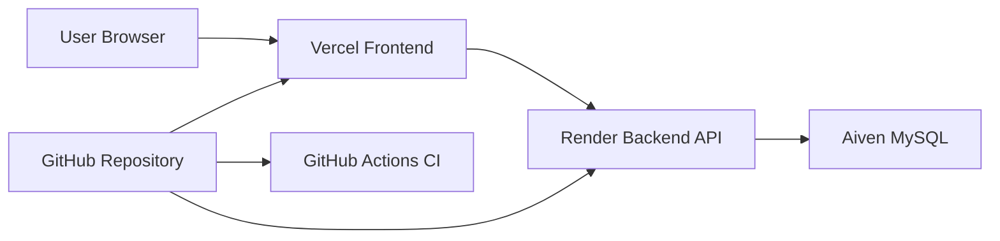
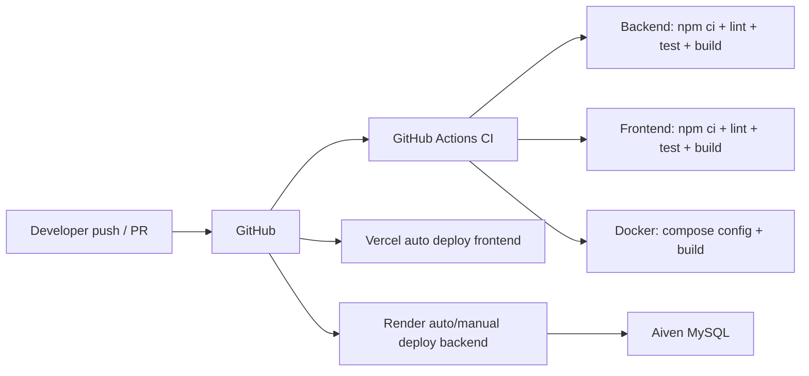

# Hướng Dẫn Triển Khai

## Mục Tiêu Deploy

Dự án được triển khai production bằng các dịch vụ cloud:

- Frontend: Vercel, build từ thư mục `frontend/`.
- Backend API: Render Web Service, build từ `backend/Dockerfile`.
- Database: Aiven MySQL.

Docker Compose vẫn được dùng cho chạy local, kiểm thử môi trường tương đương production và job CI kiểm tra cấu hình/build container. Production hiện tại không deploy trên VPS/WSL Ubuntu.

## Kiến Trúc Production



| Thành phần | Nền tảng | Cấu hình chính |
| --- | --- | --- |
| Frontend | Vercel | Root directory `frontend`, framework Vite, output `dist` |
| Backend | Render | Web Service dùng Dockerfile `backend/Dockerfile` |
| Database | Aiven | MySQL, SSL required |
| CI | GitHub Actions | Lint, test, build backend/frontend, validate Docker |

## 1. Chuẩn Bị Repository

Đẩy code lên GitHub:

```bash
git add .
git commit -m "docs: update cloud deployment guide"
git push origin main
```

Trước khi deploy, mở tab Actions trên GitHub và bảo đảm workflow `CI` pass.

## 2. Tạo Database Trên Aiven

1. Mở Aiven Console.
2. Tạo service MySQL.
3. Chờ service chuyển sang trạng thái `Running`.
4. Trong phần Connection information, copy các giá trị:

```text
Host
Port
Database name
User
Password
CA certificate
```

Nếu backend dùng biến `DB_SSL_CA_BASE64`, tải CA certificate về rồi convert sang Base64.

Linux/macOS:

```bash
base64 -w 0 ca.pem
```

Windows PowerShell:

```powershell
[Convert]::ToBase64String([IO.File]::ReadAllBytes("ca.pem"))
```

## 3. Deploy Backend Trên Render

1. Mở Render Dashboard.
2. Tạo Web Service hoặc Blueprint từ repository GitHub.
3. Nếu tạo Web Service thủ công:
   - Runtime/build: Docker.
   - Dockerfile: `backend/Dockerfile`.
   - Root directory theo cấu hình Render hoặc dùng `render.yaml` ở root repository.
4. Thêm environment variables từ Aiven và cấu hình ứng dụng:

```text
DB_HOST=<aiven mysql host>
DB_PORT=<aiven mysql port>
DB_NAME=<aiven database name>
DB_USER=<aiven database user>
DB_PASSWORD=<aiven database password>
DB_SSL=true
DB_SSL_CA_BASE64=<base64 ca certificate>
CORS_ORIGIN=*
AUTH_TOKEN_SECRET=<strong random secret>
SEED_ADMIN_PASSWORD=<strong admin password>
SEED_TEACHER_PASSWORD=<strong teacher password>
SEED_STUDENT_PASSWORD=<strong student password>
```

Dùng `CORS_ORIGIN=*` chỉ cho lần deploy đầu nếu chưa biết URL Vercel. Sau khi frontend có URL production, đổi về đúng domain Vercel.

Sau khi deploy backend, kiểm tra health:

```text
https://<render-backend>.onrender.com/api/health
```

Kết quả cần có `status: ok`. Nếu response có trường database thì database cũng cần ở trạng thái `ok`.

## 4. Deploy Frontend Trên Vercel

1. Mở Vercel Dashboard.
2. Add New Project và import repository GitHub.
3. Cấu hình:

```text
Root Directory: frontend
Framework Preset: Vite
Build Command: npm run build
Output Directory: dist
```

4. Thêm environment variable:

```text
VITE_API_BASE_URL=https://<render-backend>.onrender.com/api
```

5. Deploy và lấy URL production, ví dụ:

```text
https://sasdau.vercel.app
```

## 5. Khóa CORS Theo Domain Vercel

Sau khi có URL frontend, quay lại Render > backend service > Environment.

Đổi:

```text
CORS_ORIGIN=https://sasdau.vercel.app
```

Sau đó redeploy hoặc restart backend.

## 6. Kiểm Tra Sau Deploy

Backend:

```bash
curl https://<render-backend>.onrender.com/api/health
```

Frontend:

```text
https://sasdau.vercel.app
```

Kiểm tra bằng trình duyệt:

- Trang frontend load được.
- DevTools Console không có lỗi runtime nghiêm trọng.
- Login gọi đúng endpoint Render.
- API login trả response, không bị `pending`.
- Các màn hình danh sách lớp, sinh viên, điểm danh và báo cáo có dữ liệu.

## 7. Seed Dữ Liệu Demo

Sau khi backend đã deploy và kết nối được Aiven MySQL, có thể seed dữ liệu demo:

```bash
npm run seed:demo
```

Script này thêm:

- 5 lớp demo.
- 12 sinh viên cho mỗi lớp.
- Giảng viên demo.
- Lịch học cho từng lớp.
- 8 buổi điểm danh gần nhất theo lịch học của từng lớp.

Script dùng `ON DUPLICATE KEY UPDATE`, nên chạy lại không tạo trùng lớp/sinh viên/điểm danh. Không dùng script này nếu ENV đang trỏ tới database không muốn thay đổi.

## 8. Redeploy

Frontend:

1. Push code lên GitHub.
2. Vercel tự build lại nếu project đã kết nối repository.
3. Kiểm tra deployment mới trong Vercel Dashboard.

Backend:

1. Push code lên GitHub.
2. Render tự deploy lại nếu bật auto deploy.
3. Nếu cần chạy thủ công: Render Dashboard > backend service > Manual Deploy.
4. Kiểm tra logs và `/api/health`.

Database:

- Không tạo lại database khi redeploy backend/frontend.
- Nếu Aiven service đang `Rebuilding`, chờ về `Running` rồi restart backend Render.
- Nếu đổi password hoặc host database, cập nhật Render environment variables rồi redeploy backend.

## 9. Rollback Cơ Bản

Frontend trên Vercel:

- Vào Vercel Project > Deployments.
- Chọn deployment ổn định trước đó.
- Promote deployment đó lên production.

Backend trên Render:

- Vào Render service > Deploys.
- Chọn deploy ổn định trước đó nếu Render còn lưu.
- Hoặc revert commit trên GitHub rồi deploy lại.

Ví dụ revert bằng Git:

```bash
git log --oneline -5
git revert <commit_sha>
git push origin main
```

## 10. CI/CD Flow



CI dùng để chứng minh chất lượng build/test. CD thực tế được thực hiện qua Vercel cho frontend và Render cho backend.

## 11. Minh Chứng Cần Lưu

- Ảnh GitHub Actions workflow `CI` pass.
- Ảnh Render backend deploy succeeded.
- Ảnh Render environment đã cấu hình biến cần thiết, che các secret.
- Ảnh Aiven MySQL trạng thái `Running`.
- Ảnh backend `/api/health` trả `status: ok`.
- Ảnh Vercel frontend production load được.
- Ảnh DevTools Network login gọi endpoint Render và trả response thành công.
- Ảnh Render logs khi backend start thành công.
